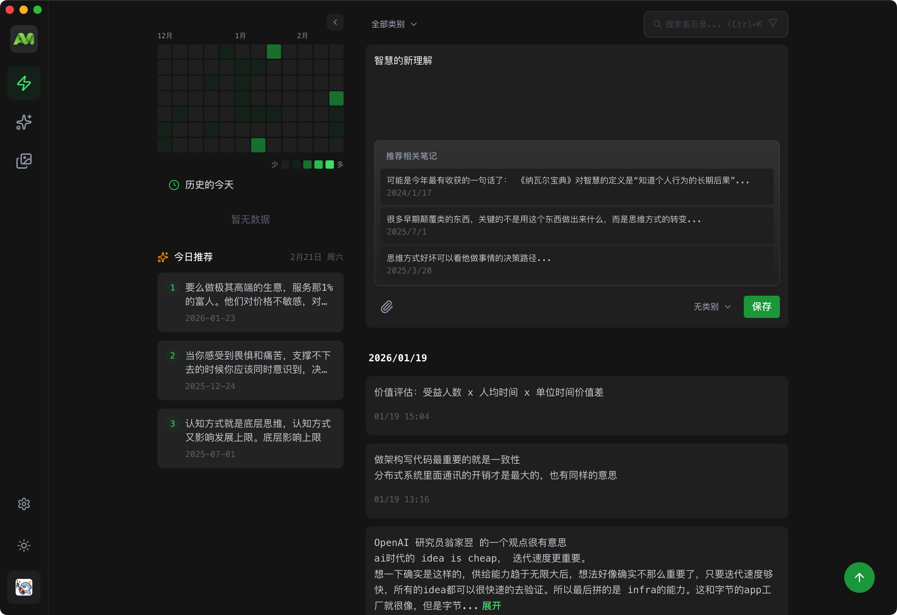
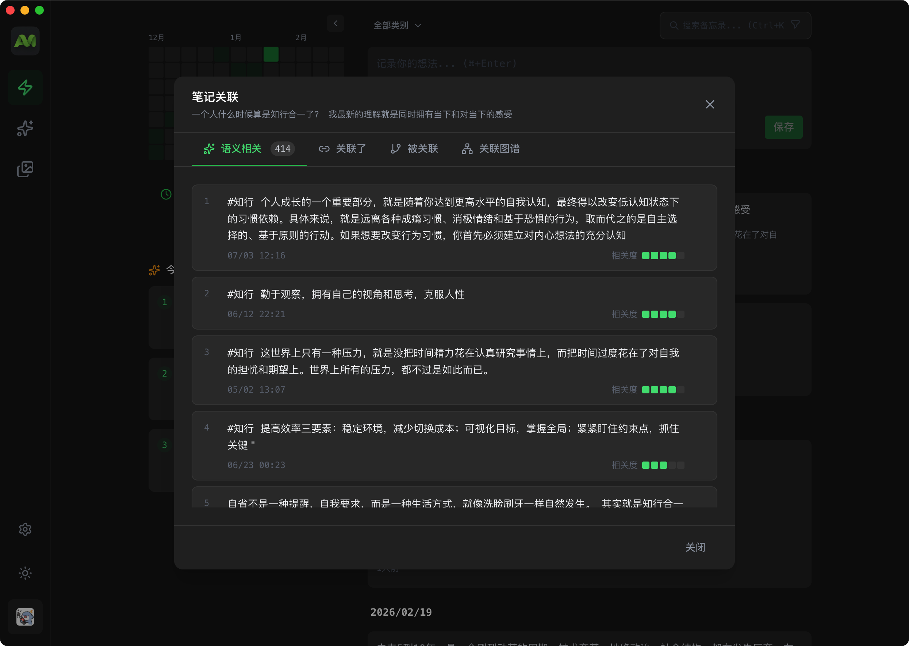
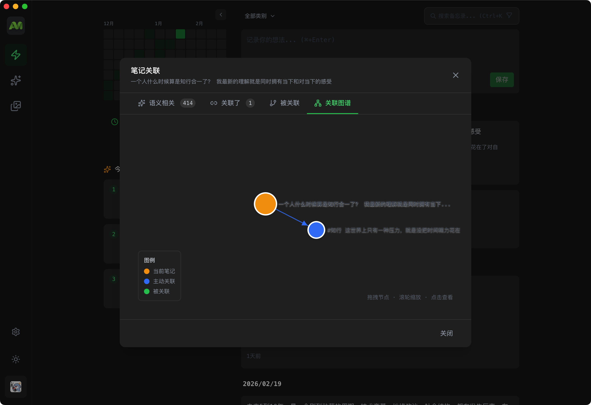
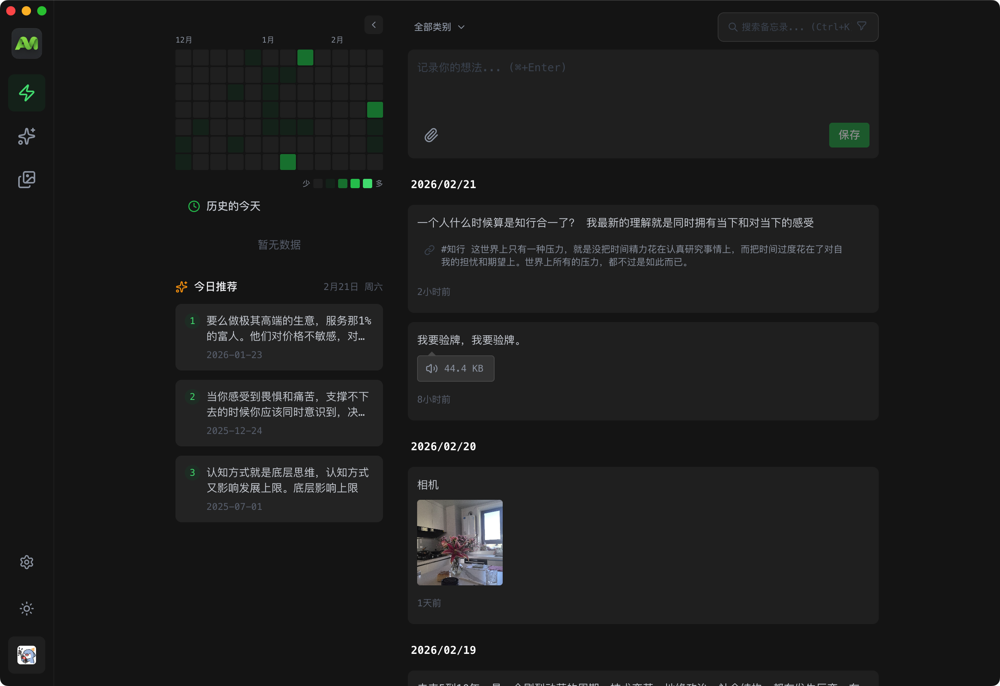
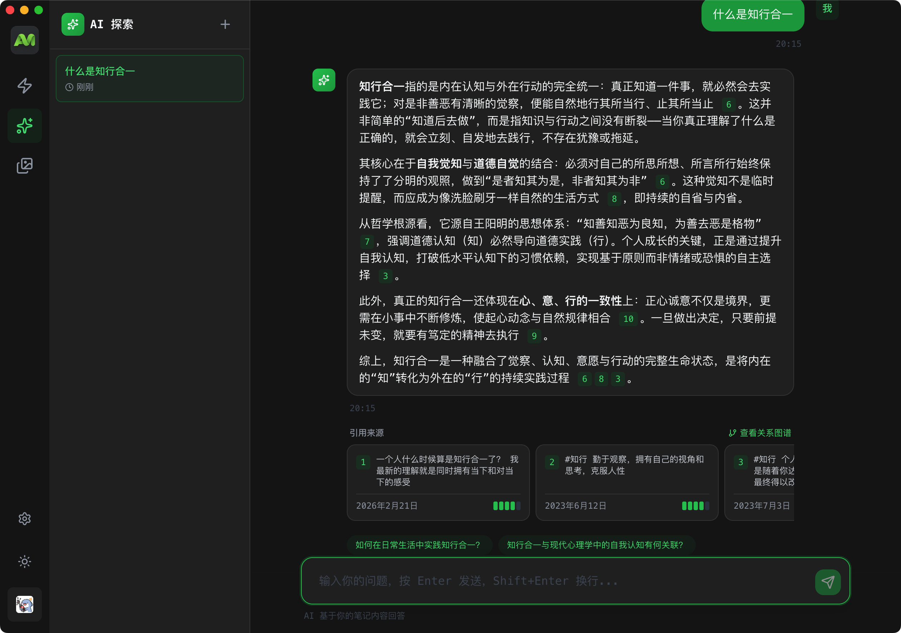
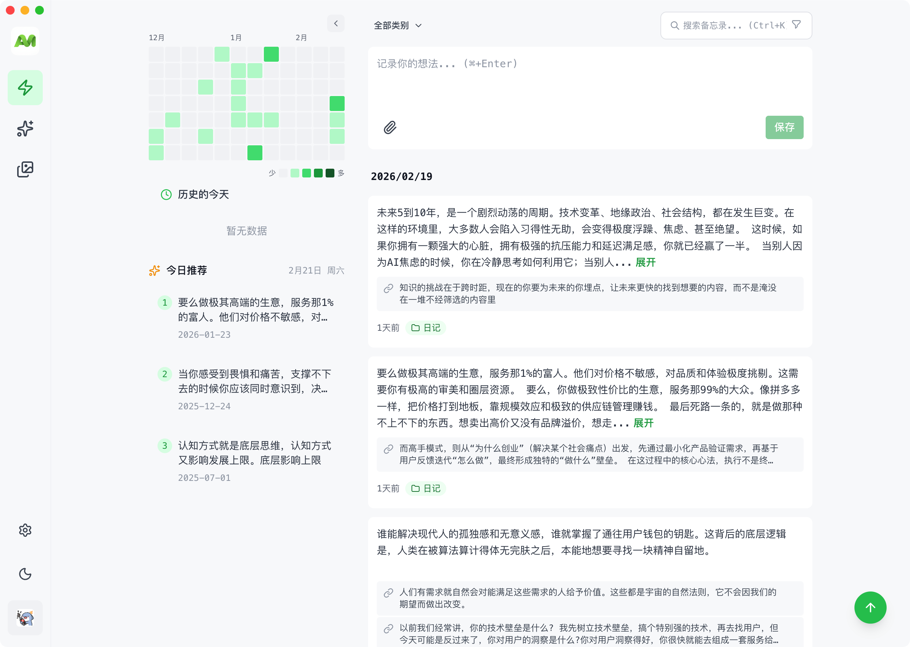

# AIMO

[](https://github.com/ximing/aimo/actions/workflows/ci.yml)
[](https://github.com/ximing/aimo/actions/workflows/docker-build.yml)


English | [简体中文](./README.md) | [Website](https://aimo.plus)

AI-first card memos. Capture a thought in one card; retrieval, linking, and review are built in. Your data stays on your machine, and can become private memory for your agents.

Source-available: free for personal use and self-hosting. Selling it as a competing SaaS requires a license ([BSL 1.1](./LICENSE)).



## Positioning

One card, one thought. AI is a first-class capability, not a bolted-on button.

|                 | AIMO                                              | Document knowledge base | Capture-only tools |
| :-------------- | :------------------------------------------------ | :---------------------- | :----------------- |
| How you write   | A stream of cards                                 | Long documents you organize | Short captures |
| AI              | First-class: search, links, review, memory        | Plugin or add-on        | Little or none     |
| Where data lives| Your server or computer                           | Local or self-hosted    | Usually the cloud  |
| Getting started | Three-line Docker, or desktop / Android           | Assemble a workflow     | Sign up            |

## ✨ Core Features

### 🤖 AI Capabilities

- **Smart Summarization** - AI automatically generates note summaries, extracting key information quickly
- **Semantic Search** - Vector-based search powered by OpenAI Embedding, understanding meaning rather than keyword matching
- **Intelligent Associations** - Automatically discovers relationships between notes, building a visual knowledge graph
- **Daily Recommendations** - Surface "On This Day" notes to rediscover past ideas
- **Spaced Repetition** - Built-in review so notes come back to you instead of disappearing into the archive

### 📝 Note Management

- **Color Tags** - 10+ color labels for intuitive note categorization
- **Category Management** - Multi-level category system for flexible knowledge organization
- **Version History** - Track note modifications, revert anytime
- **Relation Graph** - Visualize references and relationships between notes

### 🔍 Discovery & Search

- **Full-text Search** - Quickly search note titles and content
- **Tag Filtering** - Filter notes by tags
- **Calendar Heatmap** - Visualize note activity, click dates to filter
- **Smart Sorting** - Sort by time, relevance, and more

### 💻 Multi-Platform Support

- **Web App** - Responsive design for desktop and mobile browsers
- **Desktop Client** - Electron app for macOS, Windows, and Linux
- **Mobile App** - Android APK support, iOS pending release
- **Browser Extension** - Quick web content saving (in development)

### 🎨 Personalization

- **Dark/Light Theme** - One-click switching, easy on the eyes
- **PWA Support** - Install as desktop app, works offline
- **Keyboard Shortcuts** - Ctrl+K quick search for efficient operation

## 📸 Screenshots

|                Smart Note Editor                |                 Semantic Search                 |                Knowledge Graph                 |
| :---------------------------------------------: | :---------------------------------------------: | :--------------------------------------------: |
|  |  |  |

|                 Multimedia Support                  |                     AI Explore                      |                Theme Switching                 |
| :-------------------------------------------------: | :-------------------------------------------------: | :--------------------------------------------: |
|  |  |  |

## 🐳 Docker Deployment (Recommended)

All you need is Docker — no MySQL or any other dependency to pre-install. `docker-compose.yml` orchestrates the full stack: a MySQL database and the AIMO app, with tables created and initialized automatically on startup.

### Quick Start

```bash
# 1. Download the deployment files (no need to clone the whole repo)
mkdir aimo && cd aimo
curl -O https://raw.githubusercontent.com/ximing/aimo/master/docker-compose.yml
curl -o .env https://raw.githubusercontent.com/ximing/aimo/master/.env.docker.example

# 2. Edit .env and fill in the two required settings:
#    JWT_SECRET       —— a random secret, e.g. openssl rand -base64 32
#    OPENAI_API_KEY   —— OpenAI API key (for semantic search and other AI features)
#    No MySQL config needed — compose ships with one and wires it up automatically

# 3. Start
docker compose up -d
```

Once it's up, visit <http://localhost:3000> and register the first account to get started.

> 💡 The first startup pulls images and initializes MySQL, which takes about 1–2 minutes. Follow the progress with: `docker compose logs -f app`
>
> ⚠️ After registering your own account, consider setting `ALLOW_REGISTRATION=false` in `.env` and restarting with `docker compose up -d` to prevent others from signing up.

### Data Persistence

All data is persisted on the **host machine under `./data`**, not inside containers. Removing containers, pulling new images, or upgrading versions will not lose any data:

```
aimo/
├── docker-compose.yml
├── .env              # Configuration (contains JWT_SECRET — keep it safe)
└── data/
    ├── mysql/        # MySQL relational data (users, notes, categories, tags, etc.)
    ├── lancedb/      # LanceDB vector data (semantic search index)
    └── attachments/  # Attachment files (images, documents, etc.)
```

**Back up data** — stop the services, then copy the `data/` directory together with `.env`:

```bash
docker compose down
cp -r data ~/backup/aimo-data-$(date +%Y%m%d)
cp .env ~/backup/aimo-data-$(date +%Y%m%d).env
```

**Move to another machine** — repeat the Quick Start steps on the new machine, overwrite `data/` and `.env` with your backups, then run `docker compose up -d` again.

**Custom data directory** — to store data elsewhere (e.g. a NAS volume), edit `docker-compose.yml` and replace the `./data` prefix in the three volumes with your target absolute path, e.g. `- /volume1/aimo/mysql:/var/lib/mysql`.

### Upgrading

```bash
docker compose pull
docker compose up -d
```

The new container runs database schema migrations automatically on startup (both MySQL tables and LanceDB vector data upgrade themselves) — no manual steps needed. Backing up the `data/` directory before upgrading is recommended.

### Using an External MySQL (Optional)

If you already have a MySQL 8.0+ instance, you can skip the bundled MySQL container and run a single app container:

```bash
docker run -d \
  --name aimo \
  -p 3000:3000 \
  --env-file .env \
  -v $(pwd)/data/lancedb:/app/lancedb_data \
  -v $(pwd)/data/attachments:/app/attachments \
  ghcr.io/ximing/aimo:stable
```

In this case, point `MYSQL_HOST` in your `.env` at your database.

## 🛠️ Local Development

### Requirements

- **Node.js** >= 20.0
- **pnpm** >= 10.0
- **MySQL** >= 8.0 or MariaDB >= 10.6
- **OpenAI API Key** - For AI features

### Steps

```bash
# 1. Clone the project
git clone https://github.com/ximing/aimo.git
cd aimo

# 2. Install dependencies
pnpm install

# 3. Setup MySQL database
# Create database
mysql -u root -p
CREATE DATABASE aimo CHARACTER SET utf8mb4 COLLATE utf8mb4_unicode_ci;
EXIT;

# Or use Docker to start MySQL
docker compose up -d mysql

# 4. Configure environment variables
cp .env.example .env
# Edit .env, fill in MySQL connection info, JWT_SECRET and OPENAI_API_KEY

# 5. Start development server
pnpm dev

# The app will start at http://localhost:3000
```

### Common Commands

```bash
pnpm dev:web       # Start frontend only
pnpm dev:server    # Start backend only
pnpm dev:client    # Start Electron desktop client
pnpm build         # Build all apps
pnpm lint          # Code linting
pnpm format        # Code formatting
```

## 📥 Download Clients

| Platform |                         Download Link                          | System Requirements |
| :------: | :------------------------------------------------------------: | :-----------------: |
|  macOS   |   [Download](https://github.com/ximing/aimo/releases/latest)   |      macOS 12+      |
| Windows  |   [Download](https://github.com/ximing/aimo/releases/latest)   |     Windows 10+     |
|  Linux   |   [Download](https://github.com/ximing/aimo/releases/latest)   |    Ubuntu 20.04+    |
| Android  | [Download](https://github.com/ximing/aimo-app/releases/latest) |    Android 8.0+     |
|   iOS    |                        Pending release                         |          -          |

## ⚙️ Environment Variables

### Required Configuration

```env
# JWT Secret (at least 32 characters, generate with: openssl rand -base64 32)
JWT_SECRET=<random-string-at-least-32-characters>

# OpenAI API Key
OPENAI_API_KEY=sk-xxx...

# MySQL Database Connection
MYSQL_HOST=localhost
MYSQL_PORT=3306
MYSQL_USER=root
MYSQL_PASSWORD=your-mysql-password
MYSQL_DATABASE=aimo
```

### Database Configuration

AIMO uses a hybrid database architecture:

- **MySQL** (via Drizzle ORM) - Stores all relational data (users, notes, categories, tags, etc.)
- **LanceDB** - Stores vector embeddings for semantic search

```env
# MySQL Configuration (Required)
MYSQL_HOST=localhost
MYSQL_PORT=3306
MYSQL_USER=root
MYSQL_PASSWORD=your-mysql-password
MYSQL_DATABASE=aimo
MYSQL_CONNECTION_LIMIT=10

# LanceDB Configuration (Vector Storage)
LANCEDB_STORAGE_TYPE=local
LANCEDB_PATH=./lancedb_data
```

### Attachment Storage

```env
# Storage type: local or s3
ATTACHMENT_STORAGE_TYPE=local
ATTACHMENT_LOCAL_PATH=./attachments
ATTACHMENT_MAX_FILE_SIZE=52428800  # 50MB
```

For more configuration options, see [.env.example](./.env.example)

## 📁 Project Structure

```
aimo/
├── apps/
│   ├── web/              # React frontend app
│   ├── server/           # Express backend service
│   ├── client/           # Electron desktop client
│   └── extension/        # Browser extension
├── packages/
│   └── dto/              # Shared type definitions
├── docker-compose.yml    # Docker deployment config
└── package.json          # Root configuration
```

## 🤝 Contributing

1. Fork this repository
2. Create a feature branch (`git checkout -b feature/amazing-feature`)
3. Commit your changes (`git commit -m 'Add amazing feature'`)
4. Push to the branch (`git push origin feature/amazing-feature`)
5. Create a Pull Request

## 📄 License

This project is licensed under the [Business Source License 1.1 (BSL 1.1)](./LICENSE). The source is public; this is not OSI “open source”.

- ✅ **Allowed**: Personal use, learning, self-hosting, internal enterprise use
- ❌ **Prohibited**: Selling it as a competing SaaS, or offering it as a commercial hosted product
- ⏳ **Change**: Converts to MIT four years after publication, per BSL
- 💼 **Commercial license**: Contact [morningxm@hotmail.com](mailto:morningxm@hotmail.com)

## 📞 Contact Us

- 📧 Email: morningxm@hotmail.com
- 🐛 Issues: [GitHub Issues](https://github.com/ximing/aimo/issues)
- 💬 Discussions: [GitHub Discussions](https://github.com/ximing/aimo/discussions)

---

<p align="center">
  Made with ❤️ by <a href="https://github.com/ximing">ximing</a>
</p>
